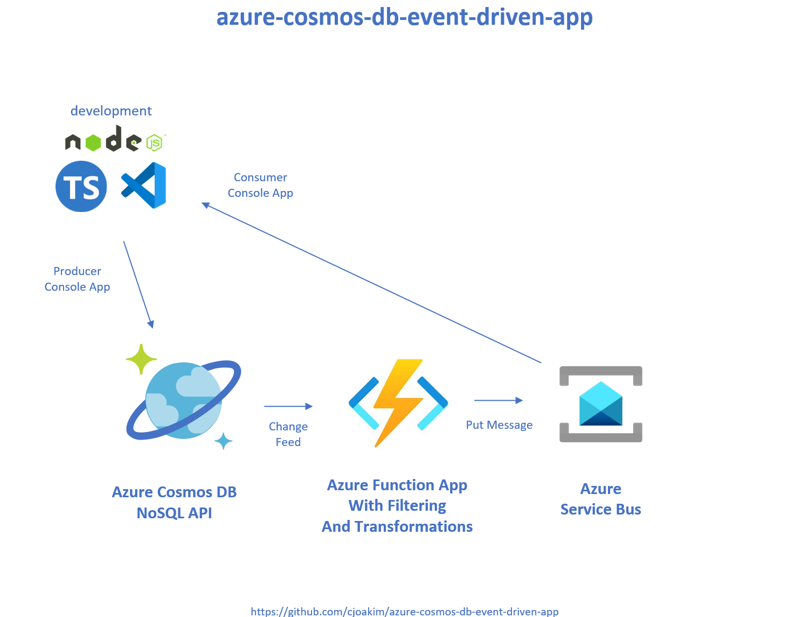

# azure-cosmos-db-event-driven-app

Example "Event-Driven" application with Azure Cosmos DB, Functions, and Service Bus.

Implemented in Node.js and TypeScript.

The instructions provided here focus on Windows 11, but similar commands
can be executed on macOS or Linux workstations.

## Architecture

<p align="center">
  
</p>

### Highlights

- **Scalability**
  - Cosmos DB Autoscale
    - https://learn.microsoft.com/en-us/azure/cosmos-db/how-to-choose-offer
  - Azure Function within an Azure App Service
    - https://learn.microsoft.com/en-us/azure/azure-functions/functions-scale
  - Azure Service Bus Premium
    - https://learn.microsoft.com/en-us/azure/service-bus-messaging/automate-update-messaging-units

- **Testability/Software Quality**
  - The transformation logic in the Azure Function can be unit tested

## Directory Structure

```
Directory        Description
------------     -----------
console_app\     Contains a "console application" with Cosmos DB document producer, and a Service Bus consumer
data\            Contains common data files used by both apps, including world-airports-50.json
function_app\    Contains a Cosmos DB Change-Feed consumer Azure Function, and Docker build script
```

## Azure PaaS Services Used

- **Azure Cosmos DB NoSQL API**
  - database name of your choice, such as **dev**
  - container name of your choice, such as **events**
    - Partition key of this container should be **/pk**
    - Minimal Request Unit (RU) setting is adequate
- **Azure Service Bus**
  - standard tier is adequate
  - queue name of your choice, such as **events**

## Software Required

- [git](https://git-scm.com/downloads)
- [Azure Functions Core Tools V4](https://learn.microsoft.com/en-us/azure/azure-functions/functions-run-local)
  - On Windows 11, download and install **v4.x - Windows 64-bit**
  - The Function Tools enable you to run Azure Functions locally on your workstation
- [Node.js](https://nodejs.org/en/download/)
  - Download and install the Latest LTS Version
- [TypeScript](https://www.typescriptlang.org/)
  - TypeScript is a language that transpiles into JavaScript
  - The generated JavaScript can be executed by Node.js, and the Azure Function runtime
- [Docker (optional)](https://www.docker.com/products/docker-desktop/)
  - Docker is optional; you can run this entire project on your workstation without it
  - The Azure Function can be deployed to Azure as a Docker image
  - A pre-build Docker image is availble on DockerHub
    - TODO

## Clone this GitHub Repository

In Windows PowerShell or a bash Terminal, navigate to a directory
such as your HOMEPATH or HOME.  Then clone this repo as follows:

```
> git clone https://github.com/cjoakim/azure-cosmos-db-event-driven-app.git
```

## Environment Variables

This application uses the following environment variables.
Configure them on your system the approprate values for
your above Cosmos DB and Service Bus.

```
AZURE_COSMOSDB_NOSQL_URI          <-- The URI of your Cosmos DB NoSQL account
AZURE_COSMOSDB_NOSQL_RW_KEY1      <-- A Cosmos DB read-write key
AZURE_COSMOSDB_NOSQL_CONN_STRING1 <-- A Cosmos DB read-write connection string
AZURE_COSMOSDB_NOSQL_DB           <-- Database name, such as 'dev'
AZURE_COSMOSDB_NOSQL_CONTAINER    <-- Container name, such as 'events'
AZURE_FUNCTION_MAX_ITEMS          <-- Number of Cosmos DB documents to process in one Azure Function invocation

AZURE_SVCBUS_CONN_STRING          <-- The connection string for your Azure Service Bus
AZURE_SVCBUS_QUEUE                <-- The queue name in your Service Bus, such as 'events'
```

These environment variables are used by both the console_app and function_app subprojects.

---

## Azure Function

### One time setup tasks

#### Install TypeScript

```
> npm install -g typescript

> npm list -g

...
`-- typescript@5.2.2     <-- see this in the list
...
```

#### Install the Azure Functions Core Tools

See https://learn.microsoft.com/en-us/azure/azure-functions/functions-run-local

Verify your installation by running the following command:

```
> func --version
4.0.5455
```

#### Install the dependent NPM packages

```
PS ...\azure-cosmos-db-event-driven-app> cd .\function_app\

PS ...\function_app> npm install

PS ...\function_app> npm list

+-- @azure/functions@4.1.0
+-- @azure/service-bus@7.9.3
+-- @types/jest@29.5.8
+-- @types/node@18.18.9
+-- azure-functions-core-tools@4.0.5455
+-- jest@29.7.0
+-- rimraf@5.0.5
+-- ts-jest@29.1.1
`-- typescript@5.2.2
```

### Unit-Test the Azure Function Transformation logic

See file **EventTransformer.ts**.  The transformation logic is extracted
into this testable class, rather than being bundled into the Azure Function
code itself.

In this example, **100% of the lines and branches of the EventTransformer were tested**.

```
PS ...\function_app> npm test

> change-feed-azure-function@1.0.0 test
> jest --verbose

 PASS  src/EventTransformer.test.ts
  √ EventTransformer: transform to message (3 ms)
  √ EventTransformer: transform to undefined (1 ms)

---------------------|---------|----------|---------|---------|-------------------
File                 | % Stmts | % Branch | % Funcs | % Lines | Uncovered Line #s
---------------------|---------|----------|---------|---------|-------------------
All files            |   38.18 |    42.85 |      20 |   37.73 |
 EventTransformer.ts |     100 |      100 |     100 |     100 |
 FileUtil.ts         |   17.07 |        0 |   11.11 |    17.5 | 21-73,87-132
---------------------|---------|----------|---------|---------|-------------------
Test Suites: 1 passed, 1 total
Tests:       2 passed, 2 total
Snapshots:   0 total
Time:        1.312 s, estimated 2 s
Ran all test suites.
```

### Start the Azure Function locally

```
> PS ...\function_app> tsc             <-- compile the TypeScript code

> PS ...\function_app> func start      <-- start the local Function App

Azure Functions Core Tools
Core Tools Version:       4.0.5455 Commit hash: N/A  (64-bit)
Function Runtime Version: 4.27.5.21554

[2023-11-14T18:43:24.418Z] Cosmos DB dbname: dev, cname: events, maxItemsPerInvocation: 1
[2023-11-14T18:43:24.421Z] Service Bus queue name: events
[2023-11-14T18:43:24.488Z] Worker process started and initialized.

Functions:

        cosmosDBTrigger1: cosmosDBTrigger

For detailed output, run func with --verbose flag.

...
[2023-11-15T15:46:04.382Z] Executing 'Functions.cosmosDBTrigger1' (Reason='New changes on container events at 2023-11-15T15:46:04.3826560Z', Id=1581da0a-937c-44e1-9b0c-e8ed7514ba6c)
[2023-11-15T15:46:04.385Z] 1 documents passed to this Function invocation
[2023-11-15T15:46:04.385Z] Executed 'Functions.cosmosDBTrigger1' (Succeeded, Id=1581da0a-937c-44e1-9b0c-e8ed7514ba6c, Duration=3ms)

[2023-11-15T15:46:04.502Z] Executing 'Functions.cosmosDBTrigger1' (Reason='New changes on container events at 2023-11-15T15:46:04.5020525Z', Id=db854afc-25dc-4e2e-b901-4bbc152d0fcb)
[2023-11-15T15:46:04.544Z] 1 documents passed to this Function invocation
[2023-11-15T15:46:04.544Z] Executed 'Functions.cosmosDBTrigger1' (Succeeded, Id=db854afc-25dc-4e2e-b901-4bbc152d0fcb, Duration=42ms)
[2023-11-15T15:46:04.544Z] {
  "body": {
    "id": "9706d077-14ce-40bc-8347-50773bbc74ed",
    "pk": "PHX",
    "country": "United States",
    "city": "Phoenix",
    "latitude": "33.434278",
    "longitude": "-112.011583",
    "altitude": "1135",
    "_message_date": "2023-11-15T15:46:04.515Z",
    "_message_version": "1"
  }
}
...
```

---

## Console App

Install and list the npm libraries, similar to the above.

```
PS ...\azure-cosmos-db-event-driven-app> cd .\console_app\

PS ...\console_app> npm install

PS ...\console_app> npm list

+-- @azure/cosmos@4.0.0
+-- @azure/identity@3.3.0
+-- @azure/service-bus@7.9.3
+-- @types/node@18.17.1
+-- @types/uuid@9.0.1
+-- azu-js@1.0.2
+-- rimraf@5.0.1
`-- uuid@9.0.1
```

### Cosmos DB Document Producer

Edit file **generate_events.ps1** as necessary, then execute it as follows.

```
PS ...\console_app> .\generate_events.ps1

dbname is dev per command-line arg
cname is events per command-line arg
newIds is true per command-line arg
sleepMs is 3000 per command-line arg
50 airports loaded from infile data/world-airports-50.json
...
---
-
{"name":"Orlando Intl","city":"Orlando","country":"United States","iata_code":"MCO","latitude":"28.429394","longitude":"-81.308994","altitude":"96","timezone_num":"-5","timezone_code":"America/New_York","location":{"type":"Point","coordinates":[-81.308994,28.429394]},"id":"f1765e83-0dd0-4eda-ba64-a832328d1df6","pk":"MCO"}
idx: 48, createResp: {
  "name": "Orlando Intl",
  "city": "Orlando",
  "country": "United States",
  "iata_code": "MCO",
  "latitude": "28.429394",
  "longitude": "-81.308994",
  "altitude": "96",
  "timezone_num": "-5",
  "timezone_code": "America/New_York",
  "location": {
    "type": "Point",
    "coordinates": [
      -81.308994,
      28.429394
    ]
  },
  "id": "f1765e83-0dd0-4eda-ba64-a832328d1df6",
  "pk": "MCO",
  "_rid": "gm8hAIWrwNn5AAAAAAAAAA==",
  "_self": "dbs/gm8hAA==/colls/gm8hAIWrwNk=/docs/gm8hAIWrwNn5AAAAAAAAAA==/",
  "_etag": "\"01015853-0000-0100-0000-6553dd560000\"",
  "_attachments": "attachments/",
  "_ts": 1699994966
}
...
```

It will read the **data/world-airports-50.json** file in this repo
and write each airport as a document to your Cosmos DB container.
It logs both the Airport as read from the file, and also the
resulting Cosmos DB response document.

The Azure Function should be triggered by these new documents.

#### "Flattening" Bulk Imports

It is recommended to **"flatten the workload"** where possible
so as to reduce Cosmos DB peak RU consumption and costs.

The above process takes a **--sleep-ms:50** parameter which causes
it to pause (i.e. - sleep) for 50 milliseconds before loading
the next document.

### Service Bus Consumer

```
PS ...\console_app> .\read_service_bus_queue.ps1

...
PS ...\console_app> .\read_service_bus_queue.ps1
sleepMs is 500 per command-line arg
batchSize is 3 per command-line arg
maxBatches is 5 per command-line arg
---
Received 3 messages
-
{
  id: '9706d077-14ce-40bc-8347-50773bbc74ed',
  pk: 'PHX',
  country: 'United States',
  city: 'Phoenix',
  latitude: '33.434278',
  longitude: '-112.011583',
  altitude: '1135',
  _message_date: '2023-11-15T15:46:04.515Z',
  _message_version: '1'
}
-
{
  id: '321390c9-afd7-4249-8129-79873a4e3134',
  pk: 'SFO',
  country: 'United States',
  city: 'San Francisco',
  latitude: '37.618972',
  longitude: '-122.374889',
  altitude: '13',
  _message_date: '2023-11-15T15:46:04.648Z',
  _message_version: '1'
}
No more messages to receive
closing the Service Bus receiver...
closing the Service Bus client...
```

This program will simply read and display the messages from
the Azure Service Bus queue.  These messages were created 
by the Change-feed Azure Function.

---

## Deployment

At this time the Azure Function is deployed to Azure via **Visual Studio Code** tooling.
The Azure Function runs within an Azure App Service.

See https://learn.microsoft.com/en-us/azure/azure-functions/functions-develop-vs-code?tabs=node-v4%2Cpython-v2%2Cisolated-process&pivots=programming-language-typescript

However, the Function can also be deployed as a Docker container.

### Build the Azure Function Docker Image

```
PS ...\function_app> .\build-docker-image.ps1
docker build...
docker ls image...
REPOSITORY                           TAG       IMAGE ID       CREATED         SIZE
cjoakim/azure-cosmos-db-cf-ts-func   latest    50d411a2b4d0   3 seconds ago   2.39GB
```

### Deploy to Azure Container Apps

https://learn.microsoft.com/en-us/azure/azure-functions/functions-deploy-container-apps?tabs=acr%2Cbash&pivots=programming-language-typescript
